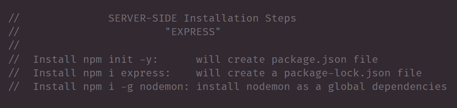
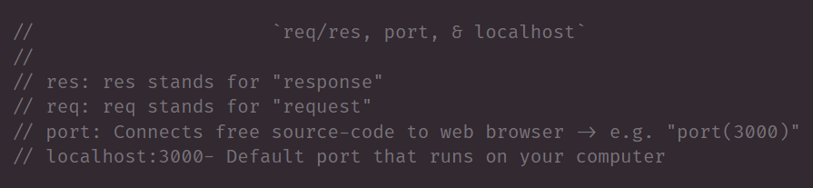
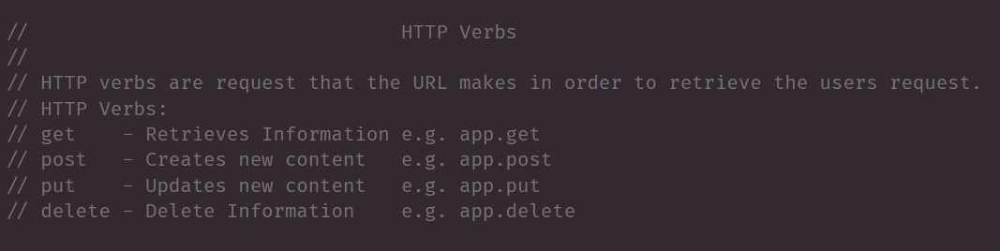

# EXPS001

```
        Index
- Express Installation
- Req/Res, Port, & LocalHost:3000
- HTTP Verbs
- Get Method 
- Browser vs Postman
- Source Reference
```

## Express Setup 



    ‣ package.json file will have your dev dependencies  
    ‣ package-lock.json will hold express v
    ‣ nodemon prevents having to restart your terminal

## Req Res Port & LocalHost:3000



    ‣ req & res are parameters that help request and respond with information to the user
    ‣ Port connects your code to the web browser
    ‣ localhost:3000 is a server for developers

## HTTP Verbs



    ‣ HTTP Verbs are "request methods to indicate the desired action to be performed" 
    ‣ Each Verb represent a action 
    ‣ There 4 are the most common used for developers

## Get Method

## Browser vs Postman

(two videos)


## Source Reference 

- [npm](https://www.npmjs.com/)
- [npm express](https://www.npmjs.com/package/express)
- [express js](https://expressjs.com/)
- [MDN web Docs](https://developer.mozilla.org/en-US/docs/Web/HTTP/Methods)

## LINKS

- [GitHub Repo Link](https://github.com/nicholasd-uci/EXPS001)
- [Nicholas Dallas's GitHub](https://github.com/nicholasd-uci)

- - -
© 2020 NPRD, Nicholas Paul Ruiz Dallas